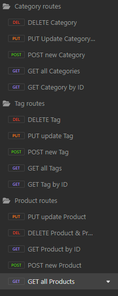

# E_Merch
  
  ## Description
    
    E_Merch is an E-commerce back end.  
  ## Table of Contents

  [Installation](##Installation)
 [Usage](##Usage)
 
  
        
  ## Installation
        
    You may install E-Merch by cloning the GitHub repo, navigating to your install folder, installing dependencies with "npm install" and if so desired running "npm run seed" to pre-populate the database. Lastly, ensure you have a a dotenv file with your MYSQL       
    credentials.
        
  ## Usage
        
    Using E-Merch may be accomplished via Insomnia (or your API development app of choice). A screenshot of the possble routes can be viewed below, and a link to a video walkthrough will also be included.

    

  ## License

  
      
  https://opensource.org/license/mit/
      
    Copyright 2023 aedelfrid

    Permission is hereby granted, free of charge, to any person obtaining a copy of this software and associated documentation files (the “Software”),

    to deal in the Software without restriction, including without limitation the rights to use, copy, modify, merge, publish, distribute, sublicense,

    and/or sell copies of the Software, and to permit persons to whom the Software is furnished to do so, subject to the following conditions:

        
    The above copyright notice and this permission notice shall be included in all copies or substantial portions of the Software.

    
    THE SOFTWARE IS PROVIDED “AS IS”, WITHOUT WARRANTY OF ANY KIND, EXPRESS OR IMPLIED,
 
    INCLUDING BUT NOT LIMITED TO THE WARRANTIES OF MERCHANTABILITY, FITNESS FOR A PARTICULAR PURPOSE AND NONINFRINGEMENT.
 
    IN NO EVENT SHALL THE AUTHORS OR COPYRIGHT HOLDERS BE LIABLE FOR ANY CLAIM, DAMAGES OR OTHER LIABILITY,
 
    WHETHER IN AN ACTION OF CONTRACT, TORT OR OTHERWISE, ARISING FROM, OUT OF OR IN CONNECTION WITH
 
    THE SOFTWARE OR THE USE OR OTHER DEALINGS IN THE SOFTWARE.
 
        
  ## Questions
        
  Please direct questions to the following;
    aedelfrid https://github.com/aedelfrid      
    almck51@gmail.com  
